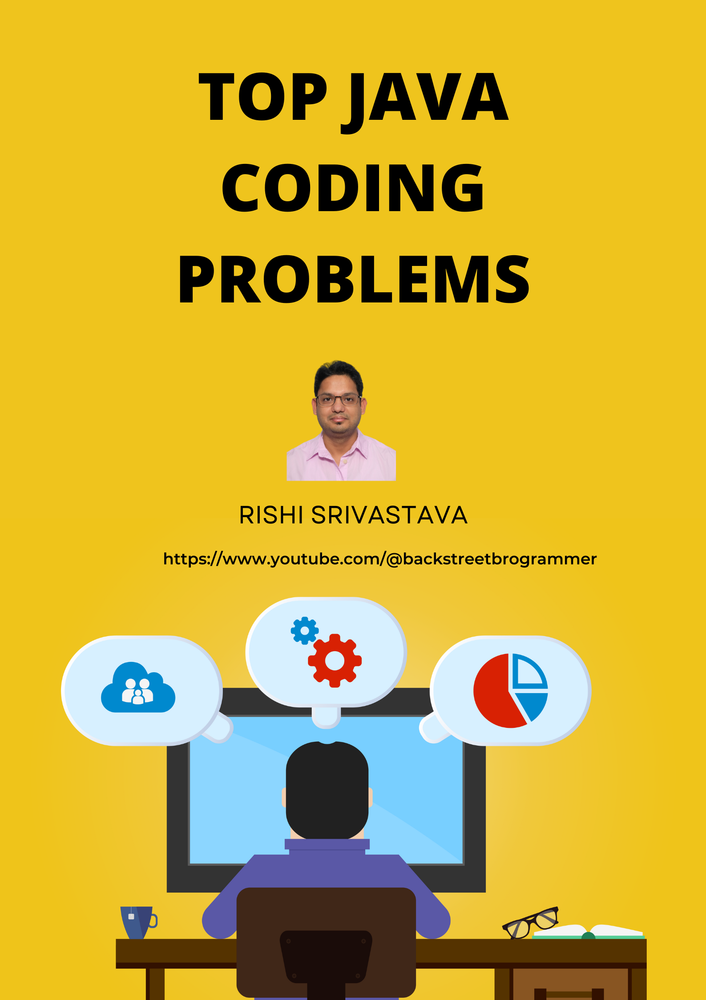
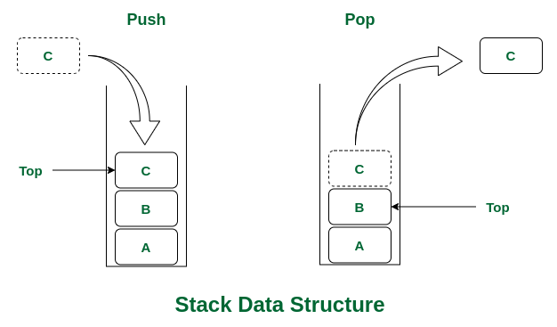
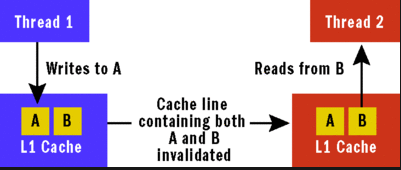
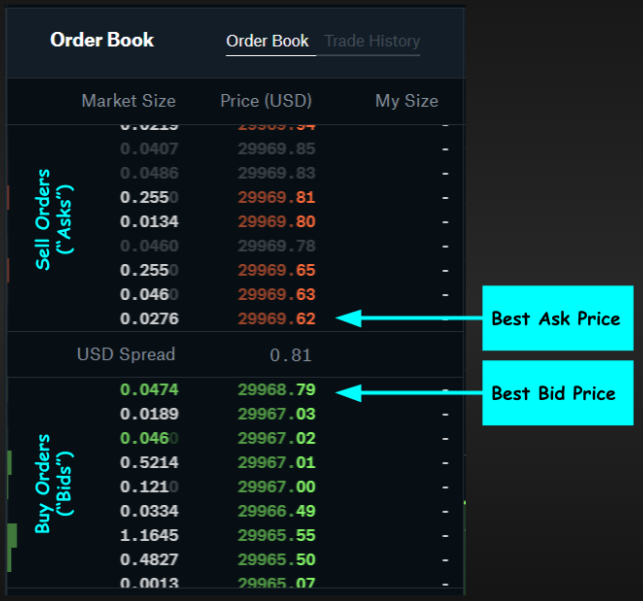
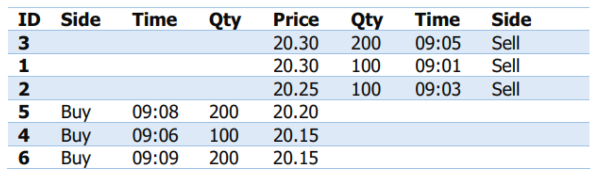
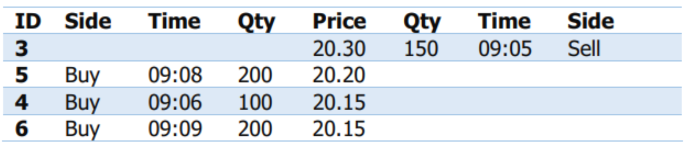

# Top Coding Interview Solutions In Java

> Collection of most popular coding interview problems and solutions in Java

## Table of contents

1. [Sort and Merge using multithreading](https://github.com/backstreetbrogrammer/13_TopCodingInterviewSolutionsInJava?tab=readme-ov-file#problem-1-sort-and-merge-using-multithreading)
    - using `Thread` / `Runnable`
    - using `CompletableFuture`
2. [Random Sampling](https://github.com/backstreetbrogrammer/13_TopCodingInterviewSolutionsInJava?tab=readme-ov-file#problem-2-random-sampling)
    - using `Collections.shuffle()`
    - using `Collections.swap()`
    - online sampling on streaming data
3. [Deadlock](https://github.com/backstreetbrogrammer/13_TopCodingInterviewSolutionsInJava?tab=readme-ov-file#problem-3-deadlock)
    - demonstrate deadlock issue
    - resolve deadlock issue
4. [Implement a `Stack` in Java](https://github.com/backstreetbrogrammer/13_TopCodingInterviewSolutionsInJava?tab=readme-ov-file#problem-4-stack)
    - without using Java collections
    - using Java collections
    - bounded concurrent stack using locks
    - concurrent stack using CAS (Atomic classes)
5. [Odd-Even printer using multithreading](https://github.com/backstreetbrogrammer/13_TopCodingInterviewSolutionsInJava?tab=readme-ov-file#problem-4-stack)
6. [Implement UNIX `tail` command in Java](https://github.com/backstreetbrogrammer/13_TopCodingInterviewSolutionsInJava?tab=readme-ov-file#problem-6-implement-unix-tail-command-in-java)
    - tail on a static file
    - tail on a running file (appended in real-time)
7. [False sharing](https://github.com/backstreetbrogrammer/13_TopCodingInterviewSolutionsInJava?tab=readme-ov-file#problem-7-false-sharing)
    - demonstrate false sharing
    - resolve false sharing
8. [Implement Read-Write Lock](https://github.com/backstreetbrogrammer/13_TopCodingInterviewSolutionsInJava?tab=readme-ov-file#problem-8-implement-read-write-lock)
    - Read Reentrant
    - Write Reentrant
    - Read to Write Reentrant
    - Write to Read Reentrant
    - Fully Reentrant
9. [Implement UNIX `find` command in Java](https://github.com/backstreetbrogrammer/13_TopCodingInterviewSolutionsInJava?tab=readme-ov-file#problem-9-implement-unix-find-command-in-java)
10. [Design LRU cache](https://github.com/backstreetbrogrammer/13_TopCodingInterviewSolutionsInJava?tab=readme-ov-file#problem-10-design-lru-cache)
11. [Design order matching engine](https://github.com/backstreetbrogrammer/13_TopCodingInterviewSolutionsInJava?tab=readme-ov-file#problem-11-design-order-matching-engine)
12. [Write a FIX Log Parser](https://github.com/backstreetbrogrammer/13_TopCodingInterviewSolutionsInJava?tab=readme-ov-file#problem-12-write-a-fix-log-parser)

### Youtube



[Top Coding Interview Solutions In Java playlist](https://www.youtube.com/playlist?list=PLQDzPczdXrTiEt7nlXb66dgiAjXhhUAUU)

- [01 - Top Java Coding Problems - Tutorial Series](https://youtu.be/uUdkLShAvkY)

---

## Problem 1: Sort and Merge using multithreading

Given an array of N size with random integers. Write a multithreaded program that performs the following operations on
this array:

- Thread 1 sorts the even numbers
- Thread 2 sorts the odd numbers
- Thread 3 merge the results with even numbers in the top part of the array

### Example:

We have an array [2, 29, 3, 0, 11, 8, 32, 94, 9, 1, 7] of 11 elements.

- Thread 1 results [0, 2, 8, 32, 94]
- Thread 2 results [1, 3, 7, 9, 11, 29]
- Thread 3 results [0, 2, 8, 32, 94, 1, 3, 7, 9, 11, 29]

### Follow up

Use `CompletableFuture` to solve the same

### Youtube

- [02 - Sort and Merge using multithreading](https://youtu.be/oR8qfx3Gops)
- [03 - Sort and Merge using multithreading - SOLUTION - Code Demo 1](https://youtu.be/yG5ksLYtINk)
- [04 - Sort and Merge using multithreading - SOLUTION - Code Demo 2](https://youtu.be/1g1Jy4lZShM)
- [05 - Sort and Merge using multithreading - SOLUTION - Code Demo 3](https://youtu.be/nAl1nnQSR7Q)
- [06 - Sort and Merge using CompletableFuture - SOLUTION - Code Demo 4](https://youtu.be/1Vj_-EDQOxU)

---

## Problem 2: Random Sampling

You are working in a software product company and the software product is being used by multiple clients. Whenever a new
feature is added to the product, company needs to select a **random subset of its clients** to roll out the new feature
in. This is needed as the company wants to see the effect of the new feature without taking the chance of alienating all
its users if the rollout is unsuccessful.

Implement an algorithm that takes as input an array of distinct elements and a size, and returns a subset of the given
size of the array elements. All subsets should be equally likely.

Hint: Use `Collections.shuffle()` method

### Example:

We have a list of integers: 1 to 10 and we need a sublist of sample size of 4 integers. Every run should give different
sublist of 4 integers as sample with equal likeliness.

### Follow up 1

Use `Collections.swap()` method

### Follow up 2

Online sampling on streaming data.

**Network packet sniffer** is designed such that to provide a uniform sample of packets for a network session.

Write a program that takes as input a size `k` and read packets, continuously maintaining a uniform random sample of
size `k` of the read packets.

### Youtube

- [07 - Random Sampling - PROBLEM STATEMENT](https://youtu.be/SjEHO2qWy7g)
- [08 - Random Sampling - SOLUTION - Code Demo 1](https://youtu.be/sFlR7Dnzp6g)
- [09 - Random Sampling - SOLUTION - Using Collections.shuffle() method](https://youtu.be/aoAeKm4_Eks)
- [10 - Random Sampling - SOLUTION - Using Collections.swap() method](https://youtu.be/jkhO8uCBs1U)
- [11 - Random Online Sampling - SOLUTION - Code Demo 1](https://youtu.be/Z_W7k-bYbqI)
- [12 - Random Online Sampling - SOLUTION - Code Demo 2](https://youtu.be/fvZr3PASqnI)
- [13 - Random Online Sampling - SOLUTION - Code Demo 3](https://youtu.be/728Pb3RbdAI)

---

## Problem 3: Deadlock

Suppose there are 2 threads T1 and T2 which need to acquire locks L1 and L2. If T1 first acquires L1 and then T2
acquires L2, they end up waiting on each other forever.

Write a program to demonstrate deadlock issue.

### Follow up

Modify the program to resolve the deadlock issue.

### Youtube

- [14 - Deadlock - PROBLEM STATEMENT](https://youtu.be/ZSA9di_lixM)
- [15 - Deadlock - SOLUTION - Code Demo 1](https://youtu.be/IPjFzRoJ4A8)
- [16 - Deadlock - SOLUTION - Code Demo 2](https://youtu.be/rwnX3uyrD0Y)

---

## Problem 4: Stack

A stack is a linear data structure that follows the LIFO - **Last-In, First-Out** principle. That means the objects can
be inserted or removed only at one end of it, also called a **top**. Last object inserted will be the first object to
get.



Implement a stack in Java without using any standard Java Collections.

Following 3 methods should be implemented from the `StackI` interface.

```java
public interface StackI<T> {

    T pop();

    void push(T item);

    T peek();

}
```

### Follow up 1

Implement a stack in Java using Java collections.

### Follow up 2

Implement a bounded concurrent stack in Java using locks.

### Follow up 3

Implement a concurrent stack in Java using CAS (Atomic classes in Java).

This solution is based on [Treiber stack algorithm](https://en.wikipedia.org/wiki/Treiber_stack)

### Youtube

- [17 - Stack - PROBLEM STATEMENT](https://youtu.be/GDeqvqme0YU)
- [18 - Stack custom implementation - SOLUTION - Code Demo](https://youtu.be/4LRcaIEA6Tg)
- [19 - Stack custom implementation - SOLUTION - Unit Test Code Demo](https://youtu.be/YiB3XGTclwo)
- [20 - Java Stack Follow Up 1 - SOLUTION - Unit Test Code Demo](https://youtu.be/85wSAvotfHY)
- [21 - Stack implementation using Locks - Follow Up 2 - SOLUTION - Code Demo 1](https://youtu.be/f14SPQfaASE)
- [22 - Stack implementation using Locks - Follow Up 2 - SOLUTION - Code Demo 2](https://youtu.be/WXsv-4YNErw)
- [23 - Stack implementation using Locks - Follow Up 2 - SOLUTION - Unit Test Code Demo 1](https://youtu.be/WX4WXJLw0nU)
- [24 - Stack implementation using Locks - Follow Up 2 - SOLUTION - Unit Test Code Demo 2](https://youtu.be/1gC7th9CFoU)
- [25 - Stack implementation using CAS - Follow Up 3 - SOLUTION - Code Demo 1](https://youtu.be/fEjY-ewwr9U)
- [26 - Stack implementation using CAS - Follow Up 3 - SOLUTION - Code Demo 2](https://youtu.be/Cb-2NDY_BLE)
- [27 - Stack implementation using CAS - Follow Up 3 - SOLUTION - Unit Test Code Demo](https://youtu.be/zLrZKsvymQY)

---

## Problem 5: Print odd and even numbers by 2 threads

Write Java code in which the 2 threads, running concurrently, print the numbers from 1 to 100 **in order**.

- Thread 1 prints odd numbers from 1 to 100
- Thread 2 prints even numbers from 1 to 100

Optionally, name the 2 threads as **OddThread** and **EvenThread** and print the thread name while printing the numbers.

Sample output:

```
i=1, [OddThread]
i=2, [EvenThread]
i=3, [OddThread]
i=4, [EvenThread]
i=5, [OddThread]
...
...
i=96, [EvenThread]
i=97, [OddThread]
i=98, [EvenThread]
i=99, [OddThread]
i=100, [EvenThread]
```

### Youtube

- [28 - Odd Even Printer Using Multithreading - PROBLEM STATEMENT](https://youtu.be/tS4G7U-FxmU)
- [29 - Odd Even Printer Using Multithreading - SOLUTION - Code Demo 1](https://youtu.be/avl3BTLAXyo)
- [30 - Odd Even Printer Using Multithreading - SOLUTION - Code Demo 2](https://youtu.be/8RQmdOSCCak)
- [31 - Odd Even Printer Using Multithreading - SOLUTION - Code Demo 3](https://youtu.be/TbUeV4sq_GY)

---

## Problem 6: Implement UNIX `tail` command in Java

UNIX `tail` command displays the last part of a file on the unix or linux server. Even if the file is being updated
currently, `tail` command will display the latest data appended to the file in real-time. Thus, `tail` command is very
useful in monitoring a running application logs.

Write a program to implement the same `tail` command like method in Java. Assume that tail method takes two arguments -
a filename, and the number of lines, starting from the last line, that are to be printed.

### Follow up

Implement the `tail` method for a **running** log file (appended in real-time).

### Youtube

- [32 - Implement UNIX tail command in Java - PROBLEM STATEMENT](https://youtu.be/9NCo8Lr-1IE)
- [33 - Implement UNIX tail command in Java - SOLUTION - Code Demo 1](https://youtu.be/yDDnpWQjNpY)
- [34 - Implement UNIX tail command in Java - SOLUTION - Code Demo 2](https://youtu.be/I9KPISd2LsQ)
- [35 - Implement UNIX tail command in Java - SOLUTION - Code Demo 3](https://youtu.be/LRucuskHIVQ)
- [36 - Implement UNIX tail command in Java - SOLUTION - Code Demo 4](https://youtu.be/iUfZN4GD668)
- [37 - Implement UNIX tail command in Java - SOLUTION - Code Demo 5](https://youtu.be/ixn7qUWKplU)
- [38 - Implement UNIX tail command in Java - SOLUTION - Code Demo 6](https://youtu.be/HIKMZX3rEGQ)

---

## Problem 7: False Sharing

In computer science, false sharing is a performance-degrading usage pattern that can arise in systems with distributed,
coherent caches at the size of the smallest resource block managed by the caching mechanism.

False sharing in Java occurs when two threads running on two different CPUs write to two different variables which
happen to be stored within the same CPU cache line. When the first thread modifies one of the variables - the whole CPU
cache line is invalidated in the CPU caches of the other CPU where the other thread is running. This means, that the
other CPUs need to reload the content of the invalidated cache line - even if they don't really need the variable that
was modified within that cache line.

In simpler words, CPU cache is organized in lines of data. Each line can hold 8 longs - 64 bytes. When a visible
variable is modified in L1 or L2 cache, all the line is marked "dirty" for the other caches. A read on a dirty line
triggers a refresh of this line -> which is to flush the data from main memory.



Write a program to demonstrate false sharing in Java.

### Follow up

Modify the program to resolve false sharing and improve performance. (Measure the performance)

### Youtube

- [39 - False Sharing - PROBLEM STATEMENT](https://youtu.be/MVz4qfZ0bzM)
- [40 - Demonstrate False Sharing - SOLUTION - Code Demo 1](https://youtu.be/zgVUMP6dO10)
- [41 - Demonstrate False Sharing - SOLUTION - Code Demo 2](https://youtu.be/q8F9-sWe_es)
- [42 - Resolve False Sharing - SOLUTION - Code Demo 3](https://youtu.be/5a5K5ELQXJQ)

---

## Problem 8: Implement Read-Write Lock

Suppose there is an `Object obj`, which is **read from** and **written by** many threads.

We need to ensure that no thread may access `obj` for reading or writing while another thread is writing to `obj`.

If no thread is writing to `obj` and no threads have **requested write access**, then multiple threads can **read**
the `obj` at the same time.

| Access Type  | Condition                                                              | 
|--------------|------------------------------------------------------------------------|
| Read Access  | If no threads are writing, and no threads have requested write access. | 
| Write Access | If no threads are reading or writing.                                  | 

Implement the synchronization mechanism which adheres to the above read-write conditions.

### Re-entrance

With a reentrant lock / locking mechanism, the attempt to acquire the same lock will succeed, and will increment an
internal counter belonging to the lock. The lock will only be released when the current holder of the lock has released
it and counter is set to zero.

It means we can do something like this on a **single** thread:

- Acquire a lock on "foo"
- Do something
- Acquire a lock on "foo". Note that we haven't released the lock that we previously acquired.
- ...
- Release lock on "foo"
- ...
- Release lock on "foo"

Here's an example in Java using primitive object locks / monitors which are reentrant:

```
final Object lock = new Object();
...
synchronized (lock) {
    ...
    doSomething(lock, ...)
    ...
}

public void doSomething(Object lock, ...) {
    synchronized (lock) {
        ...
    }
}
```

### Follow up 1 - Read re-entrance

A thread is granted **read re-entrance** if it can get read access (no writers or write requests), or if it already has
read access (regardless of **write requests**).

### Follow up 2 - Write re-entrance

Write re-entrance is granted only if the thread has already got write access.

### Follow up 3 - Read to Write re-entrance

A thread that have read access to also obtain write access. For this to be allowed the thread must be the only reader.

### Follow up 4 - Write to Read re-entrance

A thread that has got write access needs read-access too. A writer should always be granted read access if requested. If
a thread has got write access, no other threads can have read nor write access.

### Follow up 5 - Fully Reentrant ReadWriteLock

Combine all the above for fully re-entrant ReadWriteLock.

### Youtube

- [43 - Implement Read-Write Lock - PROBLEM STATEMENT](https://youtu.be/bwHID3mQ5HY)
- [44 - Implement Read Write Lock - SOLUTION - Code Demo](https://youtu.be/SGtzx3jL1Uo)
- [45 - Implement Read Write Lock - UNIT TEST CASE - Code Demo1](https://youtu.be/h8t6kJ1-PtM)
- [46 - Implement Read Write Lock - UNIT TEST CASE - Code Demo2](https://youtu.be/JYx56cI67Qs)
- [47 - Implement Read Write Lock - READ REENTRANT](https://youtu.be/E9K5kfQCJd0)
- [48 - Implement Read Write Lock - READ REENTRANT - Code Demo](https://youtu.be/G-6hBnBEOho)
- [49 - Implement Read Write Lock - READ REENTRANT - Unit Test Code Demo](https://youtu.be/Fp4BtHLaSVk)
- [50 - Implement Read Write Lock - FULLY REENTRANT Code Demo](https://youtu.be/qCrSlBGwKUU)

---

## Problem 9: Implement UNIX `find` command in Java

UNIX `find` command locates files based on some user-specified criteria and either prints the pathname of each matched
object or, if another action is requested, performs that action on each matched object.

It initiates a search from a desired starting location and then recursively traverses the nodes (directories) of a
hierarchical structure (typically a tree). `find` can traverse and search through different file systems of partitions
belonging to one or more storage devices mounted under the starting directory.

The possible search criteria include a **pattern** to match against the **filename**. By default, `find` returns a list
of all files below the current working directory, although users can limit the search to any desired maximum number of
levels under the starting directory.

Write a program to implement the same `find` command like method in Java. Assume that `find` method takes two arguments

- a directory name as String, and
- the file name pattern as String, that are to be printed

```
Usage: java JFind <directory> <filename-pattern>
```

### Youtube

- [51 - Implement UNIX find command in Java](https://youtu.be/3CHphuP4jWE)
- [52 - Implement UNIX find command in Java - SOLUTION](https://youtu.be/LARTL1g8BDc)

---

## Problem 10: Design LRU cache

In computing, a `cache` is a hardware or software component that stores data so that future requests for that data can
be served faster; the data stored in a cache might be the result of an earlier computation or a copy of data stored
elsewhere.

A `cache hit` occurs when the requested data can be found in a cache, while a `cache miss` occurs when it cannot.

Cache **hits** are served by reading data from the cache, which is faster than recomputing a result or reading from a
slower data store; thus, the more requests that can be served from the cache, the faster the system performs.

To be cost-effective and to enable efficient use of data, caches must be relatively small.

The **Least Recently Used** (`LRU`) cache is a cache eviction algorithm that organizes elements in order of use. In LRU,
as the name suggests, the element that hasn't been used for the longest time will be evicted from the cache.

Design an LRU cache using Java provided API / collections - `LinkedHashMap`.

### Follow up

Design an LRU cache which uses classic data structures and is also thread safe.

**LRU cache algorithm**

1. **Inserting key,value pair** `put(K,V)`:
    - Create a new `linked list` **node** with `key`, `value` and insert into `head` of `linked list`.
    - Insert `key -> node` mapping into `hash table`.

2. **Get value by key** `get(K)`:
    - Lookup **node** in `hash table` and return node `value`.
    - Then update **most recently used** item by moving the node to **front** (`head`) of `linked list`.
    - `Hash table` does **NOT** need to be updated.

3. **Finding least recently used**:
    - **Least recently used** item will be found at the `end` of the `linked list`.

4. **Eviction when cache is full**:
    - Remove `tail` of `linked list`.
    - Get `key` from `linked list` **node** and remove `key` from `hash table`.

### Youtube

- [53 - Design LRU cache](https://youtu.be/goKe5YE9I-U)
- [54 - Design LRU cache using LinkedHashMap in Java](https://youtu.be/lTQd43aSWOo)
- [55 - Design LRU cache using custom thread-safe data structures](https://youtu.be/wvhQ9vevmrE)
- [56 - Unit Test multi-threaded LRU cache](https://youtu.be/jwtyePBIf1U)
- [57 - Bug Fix for threading issue in LRU Cache GET method](https://youtu.be/fn7q3havXIY)

---

## Problem 11: Design order matching engine

### Basics of Stock Exchange


A stock exchange is an exchange where stockbrokers and traders can buy and sell securities, such as shares of
stock, bonds and other financial instruments.

The basic function of an exchange is to facilitate the **matching** of buyers and sellers efficiently.

A stock exchange also disseminates **Market Data** information.

All publicly traded equities have a **bid price** and **ask price** when bought and sold.

The **bid** is the **highest** price an investor is willing to **purchase** a stock.

The **ask (offer)** is the **lowest** price at which an investor is willing to **sell** a stock.

Each time a bid price or ask price is disseminated, it is considered a **quote**.

The U.S. stock market has **three** tiers of quotes:

- **Level I** quotes provide basic price data for a stock, including the **best bid** and **ask price + size** on each
  side.
- **Level II** quotes provide more information than Level I quotes by adding **market depth**. Level II typically shows
  up to the `5-10` best bid and offer prices.
- **Level III** quotes add greater market depth by providing up to `20` of the best bid and ask prices. Users, primarily
  brokers and market makers, can also input data directly.

These quotes allow an investor to see how a specific stock performs over time, and where the market action is
consolidating.

### Stock Orders

For our problem statement, we will consider only the minimum properties of an **Order**.

**_Order ID_**

We will maintain a unique integer for every Order as `OrderId`.

For amendment or cancellation of an existing (already placed) order, the original order will be referred using its
`OrderId`.

**_Side_**

Determines whether an Order is a **BUY** order or a **SELL** order. We will not cover **short sells**.

**_Order Type_**

- **Market**: Buy or Sell a stock at whatever the best price is available at the opposite side to
  guarantee that order is filled.
- **Limit**: A limit price is given with the order.
    - For **Buy**, it means that the stock should be bought **at or below** the limit price, otherwise wait (in the
      order
      book).
    - For **Sell**, it means that the stock should be bought at or above the limit price, otherwise wait (in the order
      book).

We will only cover **LIMIT** order type. We will not cover **MARKET** order type.

### Matching Engine logic

For our problem statement, we will use **price-time priority matching** for orders.

During trading, order priority is determined based on two principles:

- **price**
- **time priority**

**Principle of price priority**

**Lowest Sell** and **Highest Buy** orders take precedence over other orders.

For example, a **buy** order at `USD 1010` has priority over a buy order at `USD 1000` and will be executed first.

Similarly, a **sell** order at `USD 1000` has priority over a sell order at `USD 1010` and will be executed first.

**Principle of time priority**

Among orders at the **same price**, order accepted **earliest** by the exchange takes precedence.



### Problem Statement

Design a Stock Exchange's Matching Engine’s crossing functionality, storing orders and generate any resulting trades
from new orders.

**Example:**

Say the order book, sorted by price and time looks like this:



NB: The order for sorting by time is ascending for buy-side orders and descending for sell-side orders, so that the
order with the highest priority is always in the center and priorities decrease outwards (up or down, depending on the
side).

Now imagine a new limit order to **"buy 250 shares at 20.35"** comes in, then it will be filled, in this order:

- `100` shares at `20.25` (order #2)
- `100` shares at `20.30` (order #1)
- `50` shares at `20.30` (order #3)

This leaves the order book in the following state:



### Follow Up 1:

Implement **Market Data** dissemination.

- Level I Quotes: best bid/offer with sizes.
- Level II Quotes: display of complete Order Book at any given time.

### Follow Up 2:

Implement **cancel** of an order. We can use `OrderID` as reference.

**Example:**

- Send a new order of `200` shares at `10`
- Cancel this order using `OrderID` as reference

### Follow Up 3:

Implement **amendment** of an order (only **quantity** and/or **price**). We can use `OrderID` as reference.

Please note that if the order **price** is changed, the order priority will also change and replaced in the Order Book.

**Example:**

- Send a new order of `200` shares at `10`
- Amend qty down to `150`
- Amend price up to `15`
- Amend qty up `180` and price down to `12`

### Solution: Matching Engine Algorithm

```
1. Maintain 2 data-structures DS (array / list / queue) for BUY and SELL orders

2. When a new order arrives, add the order to BUY or SELL orders DS based on the SIDE of the order

3. Sort the orders DS:
    a) Sort the BUY orders DS in descending price order => highest priced order is at the head or index 0
    b) Sort the SELL orders DS in ascending price order => lowest priced order is at the head or index 0
    
4. Match the orders:
    a) if the head of the orders DS has BUY price >= SELL price, match otherwise don't match and exit from the loop
    b) while matching, take the minimum order qty from BUY order and SELL order and generate trades using that qty 
    c) deduct that matched qty from both the orders
    c) after matching, if the order qty becomes 0 => remove that order from the DS
    d) continue a)
```

### Youtube

- [58 - Design order matching engine](https://youtu.be/xORX6okUioM)
- [59 - Order matching engine algorithm](https://youtu.be/ZboDniiFDpc)
- [60 - Order matching engine using LinkedList](https://youtu.be/YnWzKrCQMqA)

---

## Problem 12: Write a FIX Log Parser

[FIX Protocol Primer](https://github.com/backstreetbrogrammer/55_FIX_Protocol_Study_Guide)

### Problem Statement

We are a given a FIX log as:

[fix_log2.txt](https://github.com/backstreetbrogrammer/13_TopCodingInterviewSolutionsInJava/blob/main/src/main/resources/fix_log2.txt)

We need to calculate the **position** of each stock or symbol given in the FIX log and display.

```
{MSFT=123000.0, ORCL=123000.0, SPY=-72100.0}
```

Here total position for Microsoft (`MSFT`) and Oracle (`ORCL`) stocks is `123000.0`. For `SPY`, it's `-72100.0`.

**Formula for calculating position:**

Suppose quantity of stocks traded is denoted as `qtyTraded` at price `price`.

- for all **buy** transactions: `qtyTraded * price`
- for all **sell** transactions: `qtyTraded * price * -1`

**For example:**

If we buy 100 stocks of Apple at 200 USD, then current position of Apple stocks is = `100 * 200 = 20000`

Now, if we sell 50 stocks of Apple at 100 USD, then current position of Apple stocks is = `20000 - (50*100) = 15000`


